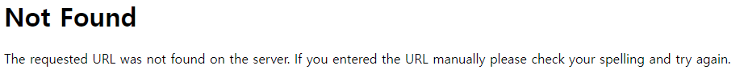

# 서버 실행

Python기반 웹 프레임워크로 WSGI (Web Server Gateway Interface)를 통해 서버를 실행

# **INDEX**

**1. [서버 실행](#서버-실행)**

**2. [라우팅](#라우팅)**

 - [변수](#변수)

**3. [METHOD](#METHOD)**

# **서버 실행**

Flask를 사용하기 위해 pip을 통해서 설치한다.

```sh
pip3 install flask
```

flask가 설치되었다면, 다음과 같이 스크립트를 작성 후 실행해본다.

port가 5000미만이면 관리자의 권한이 필요하다.

```py
from flask import Flask

app         = Flask(__name__)
app.debug   = False

if __name__ == '__main__': app.run(host='0.0.0.0', port=5000)
```

서버에 웹 브라우저를 통해 접속하면 404 Not Found를 볼 수 있을 것이다.




# **라우팅**

URL의 PATH부분을 매핑하여 함수를 호출할 수 있다.

인덱스 페이지에 대한 라우팅을 설정 후 서버에 접근해 보면 Hello World가 출력될 것이다.

```py
from flask import Flask

app         = Flask(__name__)
app.debug   = False

@app.route('/')
def index(): return 'Hello World'

if __name__ == '__main__': app.run(host='0.0.0.0', port=5000)
```

/hello/라는 라우팅을 설정하였다고 가정하면, /hello로 접근 시 Permanent Redirect Code(Method가 유지되면서 리다이렉트)가 반환되며 /hello/로 리다이렉트된다.

반면, /hello라는 라우팅을 설정하였다고 가정하면 /hello로 접근 시 200 OK가 반환되지만 /hello/로 접근 시 404 Not Found가 반환된다.

다음과 같이 라우팅을 설정한 뒤 접근하며 차이점을 확인해본다.

```py
@app.route('/hello/')
def hello(): return 'Hello'

@app.route('/world')
def world(): return 'World'
```

## **변수**

PATH의 변수를 설정할 수 있으며, 변수의 타입에 따라 다른 함수를 호출할 수 있다.

/John%20Doe로 접근하면 문자열이기 때문에 name함수가 반환된다.

123과 같이 정수형은 age함수가 반환되지만 -1과 같이 문자열이 붙혀지면 문자열로 인식되어 name함수가 반환된다.

다만, 0.5와 같이 실수형은 weight함수가 반환된다.

path타입의 경우 /a/b/c와 같이 path형식으로 접근하면 address함수가 반환된다.

```py
@app.route('/user/<string:username>')
def name(username): return "Name : {}".format(username)

@app.route('/user/<int:userage>')
def age(userage): return "Age : {}".format(userage)

@app.route('/user/<float:userweight>')
def weight(userweight): return "Weight : {}".format(userweight)

@app.route('/user/<path:userpath>')
def address(userpath): return "Path : {}".format(userpath)
```

# **METHOD**

HTTP Method를 선택하여 응답할 수 있다.

GET Method로 요청이 오면 GetMethod함수가 반환되며 data라는 인자 값을 받을 수 있다.

POST Method로 요청이 오면 GetPOST함수가 반환되며 data라는 인자 값을 받을 수 있다.

리스트이기 때문에 여러가지 Method를 하나의 함수로 처리할 수 있다.

```py
import json
from flask import jsonify
@app.route('/get', methods=['GET'])
def GetMethod(): return "Data : {}".format(request.args.get('data', default='No Data'))

@app.route('/post', methods=['POST'])
def GetPOST(): return "Data : {}".format(request.form.get('data', default='No Data'))

@app.route('/put', methods=['PUT', 'PATCH', 'DELETE'])
def GetPUT():
  try:
    if request.method == 'PUT' : print('[PUT] ', end='')
    elif request.method == 'PATCH' : print('[PATCH] ', end='')
    elif request.method == 'DELETE' : print('[DELETE] ', end='')
    JSONData = json.loads(request.data)
    print(JSONData)
    return "Data : {}".format(JSONData['data'])
  except: return jsonify({'ERROR':'Data Not Found'})
```

위의 Method로 RESTful API를 설계할 수 있지만 다음에 해본다.

| Method    | Action    |
| :---:     | :---:     |
| GET       | 조회      |
| POST      | 생성      |
| PUT       | 전체 수정 |
| PATCH     | 일부 수정 |
| DELETE    | 삭제      |