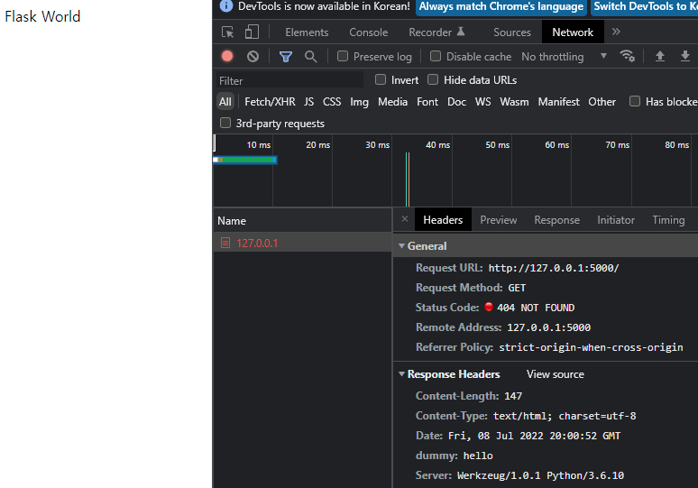

# 템플릿

Python 템플릿 엔진인 [Jinja](#https://jinja.palletsprojects.com/en/3.1.x/)를 이용하여 HTML 템플릿에서 Python과 유사한 문법을 사용할 수 있으며 flask로 부터 데이터를 받아 출력

# **INDEX**

**1. [템플릿 출력](#템플릿-출력)**

**2. [메시지 플래싱](#메시지-플래싱)**

**3. [변수](#변수)**

**4. [제어문](#제어문)**

**5. [필터](#필터)**

# **템플릿 출력**

app.run()을 실행하는 python 스크립트와 같은 폴더에 templates라는 폴더를 생성한다.

templates폴더에 다음과 같이 index.html을 생성한다.

```html
<!DOCTYPE html>
<html lang="ko">
<head>
    <meta charset="UTF-8">
    <title>Flask</title>
</head>
<body>
    <p>Hello Flask</p>
</body>
</html>
```

index.html을 불러오기 위한 flask 스크립트를 작성한다.

```py
from flask import Flask, render_template

app       = Flask(__name__)
app.debug = False

@app.route('/', methods=['GET'])
def index(): return render_template('index.html')

if __name__=='__main__':
    app.run(host='0.0.0.0', port=5000)
```

서버로 접속하면 index.html이 출력된다.

templates라는 폴더는 flask의 default 값이지만 다음과 같이 변경이 가능하다.

```py
app = Flask(__name__, template_folder='mytemplates')
```

layout을 분리하는 기능도 지원한다. index.html을 다음과 같이 작성한다.

```html


<p>Flask World</p>

```

extends를 이용하여 부모 파일에 포함된다. layout.html을 다음과 같이 작성한다.

layout.html에서는 포함할 html을 지정할 수 있는데 block의 이름을 통해 포함한다.

```html
<!DOCTYPE html>
<html lang="ko">
<head>
    <meta charset="UTF-8">
    <title>Flask</title>
</head>
<body>
    
</body>
</html>
```

서버에 접속하면 layout.html틀에 index.html내용을 확인할 수 있다.

응답 코드와 헤더를 사용자 정의로 응답할 수 있다. 다음과 같이 작성 후 서버에 접속해본다.

```py
from flask import Flask, render_template, make_response

@app.route('/')
def index(): return make_response(render_template('index.html'), 404, {'dummy':'hello'})
```

페이지가 존재하기 때문에 응답 코드가 200이 와야 하지만 404를 받고 헤더에 dummy라는 인자에 hello라는 데이터가 들어가 있다.



똑같은 방식이지만 다음과 같이 사용할 수 도 있다.

```py
@app.route('/')
def index():
    response = make_response(render_template('index.html'), 302)
    response.headers['foo'] = 'bar'
    return response
```

# **메시지 플래싱**

함수 내에서 출력되는 정보나 로그 등을 접속자에게 메시지를 전달할 수 있다. 메시지는 FIFO와 같이 메시지가 입/출력이 된다.

```py
from flask import Flask, render_template, flash, session
from secrets import token_bytes

app       = Flask(__name__)
app.debug = False
app.secret_key = token_bytes(16)

@app.route('/')
def index():
    try:
        result = 5 / 0
        flash(result)
    except Exception as e:
        flash(e)
    finally:
        flash('message flashing test')
        return render_template('index.html')
```

flash를 받기 위해서 메시지를 받는 템플릿은 다음과 같이 반복문을 통해서 메시지를 출력할 수 있다.

```html
<!DOCTYPE html>
<html lang="ko">
<head>
    <meta charset="UTF-8">
    <title>Flask</title>
</head>
<body>
    
    
    
    <script>
        alert("{{ message }}")
    </script>
    
    
    
</body>
</html>
```

# **변수**

템플릿에 다음과 같은 방법으로 변수를 넘길 수 있다.

```py
@app.route('/<string:user>', methods=['GET'])
def user(user): return render_template('user.html', user=user)
```

HTML에서 받을 변수는 다음과 같이 사용한다.

```html
<!DOCTYPE html>
<html lang="ko">
<head>
    <meta charset="UTF-8">
    <title>Flask</title>
</head>
<body>
    <p>Hello {{ user }}</p>
</body>
</html>
```

/John%20Doe로 접속하면 user함수에서 user.html에 'John Doe'를 전달하며 user.html에서 'John Doe'를 받아 출력한다.

# **제어문**

함수에서 index.html로 변수하나를 전달하자.

```py
@app.route('/', methods=['GET'])
def index(): return render_template('ifelse.html', id=-1)
```

HTML에서 조건문을 사용하여 출력을 다르게 할 수 있다.

```html
<!DOCTYPE html>
<html lang="ko">
<head>
    <meta charset="UTF-8">
    <title>Flask</title>
</head>
<body>
    
    <p>양수</p>
    
    <p>음수</p>
    
    <p>{{ id }}</p>
    
</body>
</html>
```

이번에는 배열을 전달해본다.

```py
@app.route('/')
def index(): return render_template('index.html', id=[1, 2, 3, 4])
```

HTML에서 반복문을 사용하여 출력을 해본다.

```html
<!DOCTYPE html>
<html lang="ko">
<head>
    <meta charset="UTF-8">
    <title>Flask</title>
</head>
<body>
    
    
    <p>{{ i }}</p><br>
    
    
</body>
</html>
```

# **필터**

HTML에서 변수를 처리할 때 Python의 모든 기능을 지원하지 않기 때문에 한정적이지만 필터를 사용하여 보완할 수 있다.

먼저 필터를 정의해준다. 다음은 데이터에 대해서 대문자로 변환하는 필터이다.

```py
@app.template_filter('myfilter')
def myfilter(data): return data.upper()
```

HTML로 소문자 데이터를 전달한다.

```py
@app.route('/')
def index(): return render_template('index.html', alphabet='abcd')
```

HTML에서는 필터에 데이터를 전달하고 결과를 받아 출력해준다.

```html
<!DOCTYPE html>
<html lang="ko">
<head>
    <meta charset="UTF-8">
    <title>Flask</title>
</head>
<body>
    <p>Hello {{ alphabet|myfilter }}</p>
</body>
</html>
```