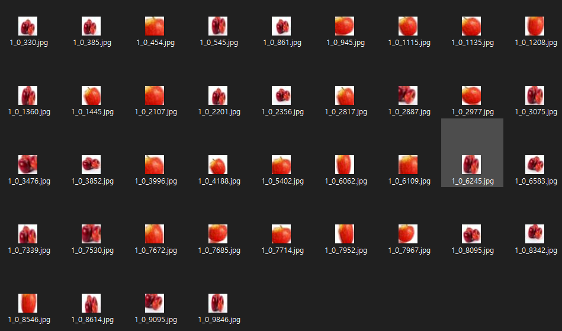

# 이미지 생성기 (Image Generator)

이미지를 학습하는 AI를 개발할 경우, 데이터가 부족할 경우가 있다.

그 때 Crop, Rotate, Crop 등을 이용하여 데이터를 복제한다.

keras를 이용하여 이미지 생성기를 작성해보자.

```py
import os, tqdm
import numpy as np
from PIL import Image
from tensorflow.keras.preprocessing.image import ImageDataGenerator, img_to_array

base_dir        = os.getcwd()
image_dir       = os.path.join(base_dir, 'apple')
output_dir      = os.path.join(base_dir, 'dataset')
width, height   = 32, 32
max_copy        = 20
dataset         = []
datagen         = ImageDataGenerator(rotation_range = 20, zoom_range = [0.5, 1.0], width_shift_range=0.1, height_shift_range=0.1, fill_mode='nearest')

for img_file in tqdm.tqdm(os.listdir(image_dir)):
    img             = img_to_array(Image.open(os.path.join(image_dir, img_file)).resize((width, height)).convert('RGB'))
    expanded_img    = np.expand_dims(img, 0)
    datagen.fit(expanded_img)
    i = 0
    for x in datagen.flow(expanded_img, save_to_dir=output_dir, save_prefix=1, save_format='jpg'):
        i+=1
        if i == max_copy: break
```

apple 폴더에는 데이터셋으로 활용할 원본 사진을 저장한다.


해당 원본 사진마다 20개씩 이미지가 조정되며 생성된다.

